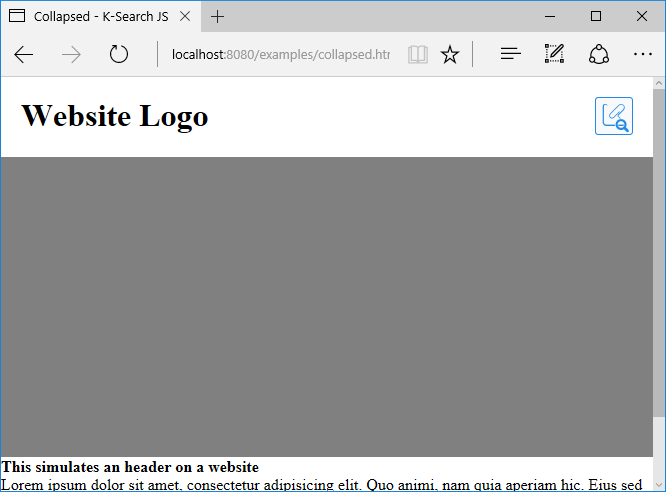

# Overlay and Collapsed style example

The `collapsed: true` option can be used together with the overlay display mode to make the search box smaller.
This is suitable in case you want to put the search in a mobile navigation, or you want to only the icon be visible.



Clicking on the K-Link icon will expand the search box.

The collapsed option can be set using `collapsed: true` option via Javascript or the `data-collapsed` boolean attribute.

```js
// initialization via javascript
ksearch({
    token: '<API_KEY>',
    selector: '#k-search',
    url: '<ENDPOINT_URL>',
    collapsed: true
});
```

```html
<!-- initialization with data attributes -->
<div id="k-search" data-ksearch-auto data-url="<ENDPOINT_URL>" data-token="<API_TOKEN>" class="k-search" data-collapsed></div>
```


```html
<!DOCTYPE html>
<html>
    <head>
        <title>Collapsed - K-Search JS</title>

        <meta name="viewport" content="width=device-width, initial-scale=1">

        <style>
            body,html {margin: 0; padding: 0}

            .header {
                height: 80px
            }

            .hero {
                height: 300px;
                background: gray;
            }

            .logo {
                float: left;
                margin: 0;
                padding: 0;
            }

            .navigation {
                display: block;
                float: right;
            }

            .logo, .navigation {
                padding: 20px;
                box-sizing: border-box;
            }

        </style>
    </head>

    <body>

        <div id="website1">
            <header class="header">
                <h1 class="logo">Website Logo</h1>
                <div class="navigation">
                    <div id="k-search" class="k-search"></div>
                </div>
            </header>

            <div class="hero">
                
            </div>
            <div>
                <strong>This simulates an header on a website</strong><br/>
                Lorem ipsum dolor sit amet, consectetur adipisicing elit. Quo animi, nam quia aperiam hic. Eius sed illo vitae, nisi quod dolore dicta voluptates magni sapiente eveniet porro sit cupiditate, distinctio.
            </div>

        </div>

        <div class="page"></div>

        <link rel="stylesheet" href="../dist/css/k-search.css" />
        <script type="text/javascript" src="../dist/js/k-search.js"></script>
        <script>
            ksearch({
                token: '<API_KEY>',
                language: 'en',
                selector: '#k-search',
                collapsed: true,
                url: 'https://test.klink.asia/kcore'
            });
        </script>
    </body>
</html>
```
