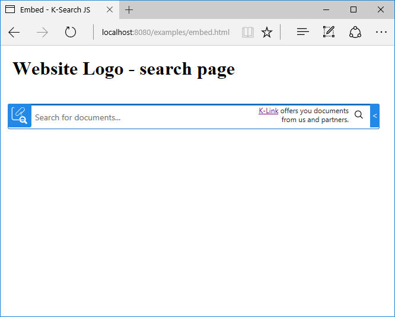

# Embedding style example

The `display: 'embed'` option make the search be always visible and use all the available space.
This is suitable for a full page dedicated to the search, like in the image below.



This style can be achieved by using the option `display: 'embed'`, if the library is initialized 
via javascript, or by using the `data-display="embed"` attribute, if the initialization is done with 
`data-` attributes.

```js
// initialization via javascript
ksearch({
    token: '<API_KEY>',
    selector: '#k-search',
    display: 'embed',
    url: '<ENDPOINT_URL>'
});
```

```html
<!-- initialization with data attributes -->
<div id="k-search" data-ksearch-auto data-url="<ENDPOINT_URL>" data-token="<API_TOKEN>" class="k-search" data-display="embed"></div>
```


The next code block shows a full page example of the integration

```html
<!DOCTYPE html>

<html>
    <head>
        <title>Embed</title>

        <meta name="viewport" content="width=device-width, initial-scale=1">

        <style>
            body,html {margin: 0; padding: 0}

            .header {
                height: 80px
            }

            .hero {
                height: 300px;
                background: gray;
            }

            .logo {
                float: left;
                margin: 0;
                padding: 0;
            }

            .navigation {
                display: block;
                float: right;
            }

            .logo, .navigation, .page {
                padding: 20px;
                box-sizing: border-box;
            }

        </style>
        <link rel="stylesheet" href="https://releases.klink.asia/k-search-js/0/k-search.min.css" />
    </head>
    <body>
        <div id="website1">            
            <header class="header">
                <h1 class="logo">Website Logo - search page</h1>
            </header>
        </div>


        <div class="page">

            <div id="k-search" class="k-search">

            </div>

        </div>

        <script type="text/javascript" src="https://releases.klink.asia/k-search-js/0/k-search.min.js"></script>
        <script>
            ksearch({
                token: '<API_KEY>',
                selector: '#k-search',
                display: 'embed',
                url: '<ENDPOINT_URL>'
            });
        </script>
    </body>
</html>
```


