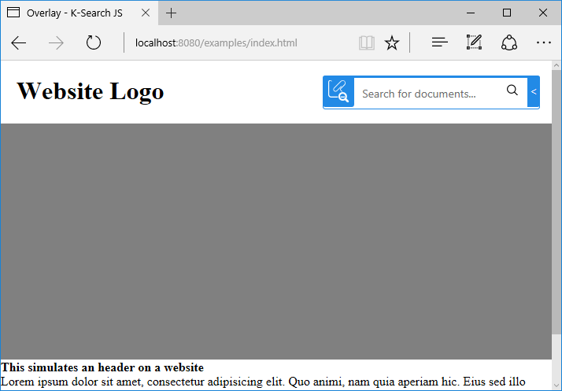

# Overlay style example

The `display: 'overlay'` option, which is the default one, make the search visible and use all the available space.
This is suitable for putting the search on the header of the page, like in the image below.

This style is the default style. You could force it using `display: 'overlay'`, if the library is initialized 
via javascript, or by using the `data-display="overlay"` attribute, if the initialization is done with 
`data-` attributes.



The style will take the available space of the container as the base width. When the user interacts with the search 
field it will expand it on top of the sorrounding elements to make more room for writing the search terms.
The search results are displayed in a dialog right below the search form.

The ability to auto-expand when in focus is controlled by the option `expandable`, which by default is set to true.
The expandable configuration can only be changed using Javascript initialization.

```js
// initialization via javascript
ksearch({
    token: '<API_KEY>',
    selector: '#k-search',
    display: 'overlay',
    url: '<ENDPOINT_URL>',
    expandable: true
});
```

```html
<!-- initialization with data attributes -->
<div id="k-search" data-ksearch-auto data-url="<ENDPOINT_URL>" data-token="<API_TOKEN>" class="k-search" data-display="overlay"></div>
```


```html
<!DOCTYPE html>
<html>
    <head>
        <title>Overlay - K-Search JS</title>
        <meta name="viewport" content="width=device-width, initial-scale=1">
        <style>
            body,html {margin: 0; padding: 0}

            .header {
                height: 80px
            }

            .hero {
                height: 300px;
                background: gray;
            }

            .logo {
                float: left;
                margin: 0;
                padding: 0;
            }

            .navigation {
                display: block;
                float: right;
            }

            .logo, .navigation {
                padding: 20px;
                box-sizing: border-box;
            }

        </style>
        <link rel="stylesheet" href="https://releases.klink.asia/k-search-js/0/k-search.min.css" />
    </head>
    <body>
        <div id="website1">
            
            <header class="header">
                <h1 class="logo">Website Logo</h1>
                <div class="navigation">
                    <div id="k-search" data-ksearch-auto data-url="<ENDPOINT_URL>" data-token="<API_TOKEN>" class="k-search"></div>
                </div>
            </header>

            <div class="hero">
                
            </div>

            <div>
                <strong>This simulates an header on a website</strong><br/>
                Lorem ipsum dolor sit amet, consectetur adipisicing elit. Quo animi, nam quia aperiam hic. Eius sed illo vitae, nisi quod dolore dicta voluptates magni sapiente eveniet porro sit cupiditate, distinctio.
            </div>

        </div>

        <div class="page"></div>

        <script type="text/javascript" src="https://releases.klink.asia/k-search-js/0/k-search.min.js"></script>
    </body>
</html>
```
